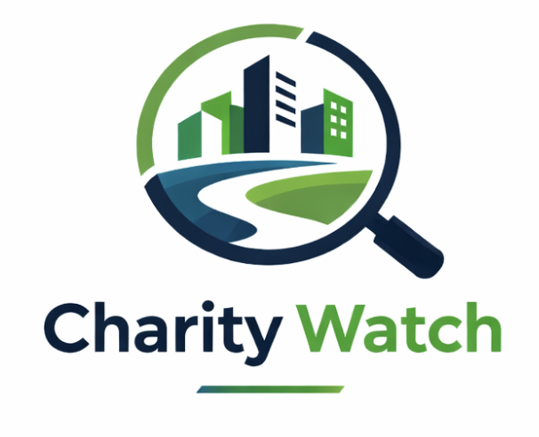

# Tower Hamlets Charity App

<p align="center">
  
</p>

## The Problem
The generation of social capital is fundamental for improving the resilience of communities. For this, the voluntary and community sector (VSC) plays a fundamental role. 

## Aim
This application has two main aims. The first is to act as a data tool that allows the council to make more informed commissioning decisions for the borough's charities. The second is to allow charities to understand the social micro-context in which their charities are located and operate in.

## Project Structure
This repo contains all files used in the development of the project. At the highest level there are three main directories: charity_watch_streamlit, notebooks_data_processing and data. Importantly the app itself is fully and independently contained within the `charity_watch_streamlit` directory. The `notebooks_data_processing` directory contains all preprocessing steps to produce the final 4 main datasets used to develop the application, including all notebooks used to explore and clean data and all pipeline and processing scripts. The `data` directory contains all raw, processed and final datasets. Note that the final datasets where themselves later imported within the `charity_watch_streamlit` directory's `data` folder, thus the main app directory can be used independently.

```
├── charity_watch_streamlit
│   ├── data
│   ├── resources
│   ├── services
│   ├── style
│   ├── tests
│   ├── __init__.py
│   ├── app.py
│   └── packages.txt
├── data
│   ├── clean_data
│   ├── final_data
│   └── raw_data
├── notebooks
│   ├── bubble_chart.ipynb
│   ├── charity_data.ipynb
│   ├── deprivation_data.ipynb
│   ├── final_dataset.ipynb
│   ├── fixing_final_dataset.ipynb
│   ├── lsoa_data.ipynb
│   ├── lsoa_geojson.ipynb
│   ├── postcodes.ipynb
│   ├── spider_diagram.ipynb
│   ├── lsoa_imd.py
│   └── pipeline.py
├── README.md
├── pyproject.toml
├── requirements.txt
└── uv.lock
```

### The App Directory

```
charity_watch_streamlit
├── data
│   ├── charities_with_deprivation.csv
│   ├── charities_with_deprivation.json
│   ├── lsoa_clean.geojson
│   └── lsoa_to_imd_mapping.json
├── resources
│   ├── charity_watch_logo.png
│   └── tower_hamlets_image.jpg
├── services
│   ├── api_line_chart.py
│   ├── bubble_chart.py
│   ├── config.py
│   ├── helpers.py
│   ├── load_charity_api_data.py
│   ├── load_data.py
│   ├── map.py
│   ├── similar_charities.py
│   └── spider_diagram.py
├── style
│   └── style.py
├── tests
│   ├── test_bubble_chart.py
│   ├── test_helpers.py
│   ├── test_load_data.py
│   └── test_map.py
├── __init__.py
├── app.py
└── packages.txt
```

## Dependencies
To build the app locally you need to have Python 3.10+ and the following packages:
```
streamlit>=1.38.0
streamlit-folium
streamlit-extras
pandas
geopandas
folium
plotly
shapely
scikit-learn
requests
python-dotenv
```
You can access them via the `requirements.txt` file.

## How to Run
There are two ways to Run the application.
##### 1. Use the deployed app:
- Use the app through the Streamlit Cloud Link: https://charity-watch.streamlit.app/
##### 2. Run it locally (harder):
- To run locally pull the `charity_watch_streamlit` directory into your preferred IDE.
- Install all requirements listed in `requirements.txt` using pip or uv (preferred)
- Get an API key from the UK Charity Commission API:
  - Go to: https://api-portal.charitycommission.gov.uk/ and register for a free account
  - Get an API key
  - Copy the API key
  - Create a .env file within the directory and paste your key in `CCEW_API_KEY = "PASTE YOUR KEY HERE"`
  - Save the .env file
- Get an API key from Google Cloud Console
  - Go to https://console.cloud.google.com/ and create a project (or use an existing one)
  - Enable the Maps Embed API under APIs & Services
  - Generate an API key under Credentials
  - Add the API key to the .env file by pasting it into `GOOGLE_MAPS_API_KEY="YOUR_KEY_HERE"`
- You are ready to run. If using uv set the environment with `uv sync` and then run `uv run streamlit run app.py ` within the charity_watch_streamlit directory.
